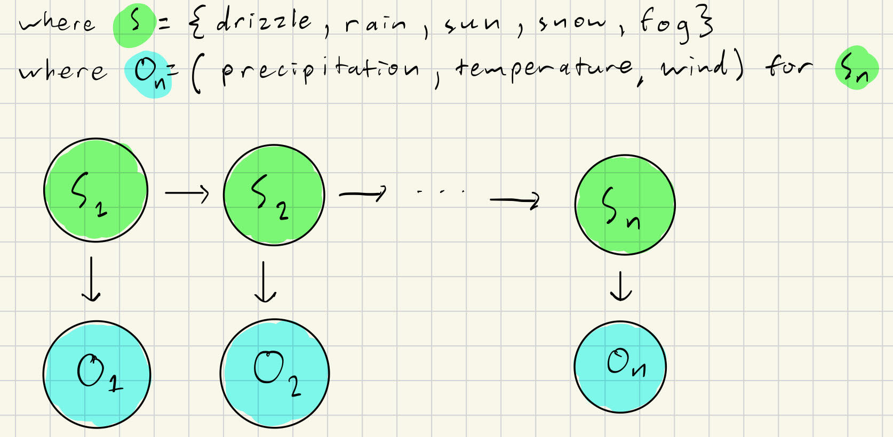

# CSE150AMilestone3

Model: Milestone3.ipynb

Sources: 
https://hmmlearn.readthedocs.io/en/latest/tutorial.html
chatgpt.com
https://www.kaggle.com/datasets/ananthr1/weather-prediction

Overview: This project finds the most likely weather state given observed data such as minimum temperature, maximum temperature, wind speed, and precipitation using a Gaussian Hidden Markov Model. This HMM is referred to as 'Gaussian' because it assumes the observations follow a Normal/Gaussian distribution. We use a Gaussian Hidden Markov Model because our weather features are continuous numerical values rather than discrete values.

PEAS: In terms of PEAS, the environment consists of real-world weather patterns, specifically those of Seattle, where the dataset originates. The performance measure of our model is its accuracy in predicting weather states (past, present, and future) based on observed data such as temperature, wind speed, and precipitation. The higher its accuracy, the better its performance. The actuators in our model are the predicted probability distribution over possible weather states. The sensors are the historical weather data input into the model which consists of a sequence of continuous numerical observations.

Agent Type: We first preprocessed our data to get it ready for computation. We checked if rows had NULL values or blank columns and removed those with missing data and changed the weather column into numerical values. Our agent is a passive model-based learning agent that uses probabilistic reasoning to reach conclusions. Specifically, it uses a Gaussian Hidden Markov Model to predict weather states. The agent is trained on an initial dataset to estimate the emission and transition matrices which define the probabilistic relationships between hidden weather states and observed weather features. However, it does not actively update or improve its model in response to new data unless explicitly retrained. Using these learned probability distributions and algorithms such as the Viterbi algorithm, the agent infers the most likely sequence of weather states given a sequence of observations.





As seen in our above diagram, this Hidden Markov Model (HMM) is defined by:
(Prompted ChatGPT for information about the equations related to Guassian Hidden Markov Model and how to format them in markdown/latex https://chatgpt.com/share/67d78ef5-f1bc-8000-bbf5-0a0bdbe9c4ab)
- States $\( S = \{S_1, S_2, \dots, S_n\} \)$, where $\( S_n \)$ represents a hidden weather state.
- Observations $\( O = \{O_1, O_2, \dots, O_T\} \)$, where $\( O_t \)$ is a vector of multiple observed features at time step $\( t \)$. Each observation is made up of 
  $\[
  O_t = (\text{Precipitation}_t, \text{MaxTemperature}_t, \text{MinTemperature}_t, \text{Wind Speed}_t)
  \]$
- Transition probabilities $\( A = [A_{ij}] \)$, where $\( A_{ij} \)$ is the probability of transitioning from state $\( S_i \) to \( S_j \)$.
  $\[
  A_{ij} = P(S_t = S_j \mid S_{t-1} = S_i)
  \]$
- Emission probabilities $\( B = [B_{ik}] \)$, where $\( B_{ik} \)$ is the probability of observing $\( O_t \)$ given hidden state $\( S_i \)$.
  $\[
  B_{ik} = P(O_t = O_k \mid S_t = S_i)
  \]$
  Where $\( O_k \)$ is an observation vector $\( O_t = (\text{Precipitation}_t, \text{MaxTemperature}_t, \text{MinTemperature}_t, \text{Wind Speed}_t) \)$.

For a Gaussian HMM, the emission probability is calculated using a Normal distribution for each hidden state. For simplicity we use hmmlearn a Python library to implement the Gaussian HMM. For each observation at time $\( t \)$, which is a vector $\( O_t = (o_{t1}, o_{t2}, o_{t3}, o_{t4}) \)$, where $\( o_{t1} \)$ represents precipitation, $\( o_{t2} \)$ represents maximum temperature, $\( o_{t3} \)$ represents minimum temperature, and $\(o_{t4} \)$ represents the wind speed. Here the emission probability is calculated by the probability density function of the multivariate Gaussian/Normal distrubition:

$\[
P(o_t \mid s_t = i) = \frac{1}{\sqrt{(2\pi)^d |\Sigma_i|}} \exp\left(-\frac{1}{2}(o_t - \mu_i)^\top \Sigma_i^{-1}(o_t - \mu_i)\right)
\]$

Where:
- $\( P(o_{tm} \mid S_i) \)$ is the probability of observing the $\( m \)$-th feature $\( o_{tm} \)$ (e.g., the temperature or wind speed) given hidden state $\( S_i \)$.
- $mu_i$ represents the normal distrubution's mean for state $s_t=i$
- $|\Sigma_i|$, normal distrubution's covariance matrix for state $s_t=i$
- Another importance to note is how each observation as a separate node (precipitation vs. wind) i.i.d, where they are conditionally independent when conditioned on $\( S_n \)$ due to the fork condition of d-separation. This can especially be seen in the photo above.

From Model Training Section:
```python
#Get a single feature vector for obs/labels
X = df[['precipitation', 'temp_max', 'temp_min', 'wind']].values #observations
Y = df['weather_cat'].values

#Split training and test data
X_train, X_test ,Y_train, Y_test = train_test_split(X, Y, test_size = 0.2, random_state = 42)

#Define and train the Gaussian HMM
n_states = 5
model = GaussianHMM(n_components=n_states, covariance_type="diag", n_iter=1000, random_state=42)
model.fit(X_train)

#Predict hidden states for the test set
predicted_states_train = model.predict(X_train)
```

Conclusion:
We initially attempted to categorize the continuous data into discrete bins to utilize the multinomial HMM from hmlearn, however these modifications of the data led to the model not performing well which is why we switched to use a Gaussian model instead. Our Gaussian Hidden Markov Model (HMM) predicts weather states based on observed data where it acheived an accuracy of 82.94% on the test set. This shows that the model is able to capture underlying weather patterns and generalize relatively well to unseen data. Our confusion matrix showed us that although the most common states (Sun and Rain) were often classfied correctly (only 8 misclassifications total), however, the less common states were often overshadowed and were easily misclassified as one of the other two (42 misclassifications total). We believe this could've been because the amount of data resulted in biases towards states (like Sunny) or because states with similar conditions such as (Snow and Rain) are hard to tell apart with such a small amount of differentiating data. It's also possible that even though our dataset had labels for every day, they weren't specific enough and could've been differentiated into more states which means states that were more common would've been split up and wouldn't have overshadowed other states as easily. Due to the accuracy our model achieved, the agent's performance did moderately well, but of course there can be room for improvement. Future work to improve our model could be further training on a much more extensive dataset as it seems that there might not have been enoguh data to categorize well. It didn't help that the data was onlty from a specific area either as that means our findings might only be generalized to Seattle. Some other possible modifications include modifying some of the parameters of the Gaussian HMM that the hmlearn library provides, changing the time-frame (such as using hours) to capture more specific patterns, or inluding the date so we could see more variation related to the season. 

